<!-- ═══════════════════════════════════════════════════════════════ -->
<!--                              HEADER                             -->
<!-- ═══════════════════════════════════════════════════════════════ -->

<!-- ═══════════════════════════════════════════════════════════════ -->
<!--                                MESSAGE                          -->
<!-- ═══════════════════════════════════════════════════════════════ -->

  
  

<!-- ═══════════════════════════════════════════════════════════════ -->
<!--                                ME                               -->
<!-- ═══════════════════════════════════════════════════════════════ -->

## ☺️ &nbsp;About Me

<table border="0" cellspacing="20" cellpadding="20">
  <tr>
    <td align="center" style="padding: 20px;">
      
    </td>

  <td align="center" style="padding: 20px;">
    
  </td>
  </tr>

  <tr>
    <td align="center" style="padding: 20px;">
      
    </td>

  <td align="center" style="padding: 20px;">
    
  </td>
  </tr>
</table>

<!-- ═══════════════════════════════════════════════════════════════ -->
<!--                        TECH STACK                             -->
<!-- ═══════════════════════════════════════════════════════════════ -->

## 🛠️ &nbsp;Tech Stack

 

**Languages**

**Web**

**Databases**

**System & DevOps**

**Music**

<!-- ═══════════════════════════════════════════════════════════════ -->
<!--                      Student Projects                           -->
<!-- ═══════════════════════════════════════════════════════════════ -->

## 🚀 &nbsp;Student Projects

  
  <table border="0">

  <tr>
  <td width="50%" valign="top">
  
  ### [🚩 Snowcrash](https://github.com/Lanouuu/snow-crash)
  
  
  
   
  
  <h3>
  42 project | Cybersecurity branch
  </h3>
  Capture the flag with multiple levels on a pre-build sandbox
  
  </td>
  <td width="50%" valign="top">
  
  ### [💻  Minishell](https://github.com/Lanouuu/Minishell)
  
  
  
   
  
  <h3>
  42 project | Common Core
  </h3>
  Light command-line interpreter based on Bash
  
  </td>
  </tr>
  <tr>
  <td width="50%" valign="top">
  
  ### [🔧 Libasm](https://github.com/Lanouuu/Libasm)
  
  
   
  
  <h3>
  42 project | System & Kernel branch
  </h3>
  
  Small x86_64 assembly library
  
  </td>
  <td width="50%" valign="top">
  
  ### [🎾 Transcendance](https://github.com/Lanouuu/Transcendance)
  
  
  
  
  
  
  
  
   
  
  <h3>
  42 project | Common core
  </h3>
  
  Full-stack web application. It reimagines the classic Pong game with modern features such as real-time multiplayer, user authentication, and social interactions.
  
  </td> 
  </tr>
  </table>

<!-- ═══════════════════════════════════════════════════════════════ -->
<!--                              FOOTER                             -->
<!-- ═══════════════════════════════════════════════════════════════ -->

